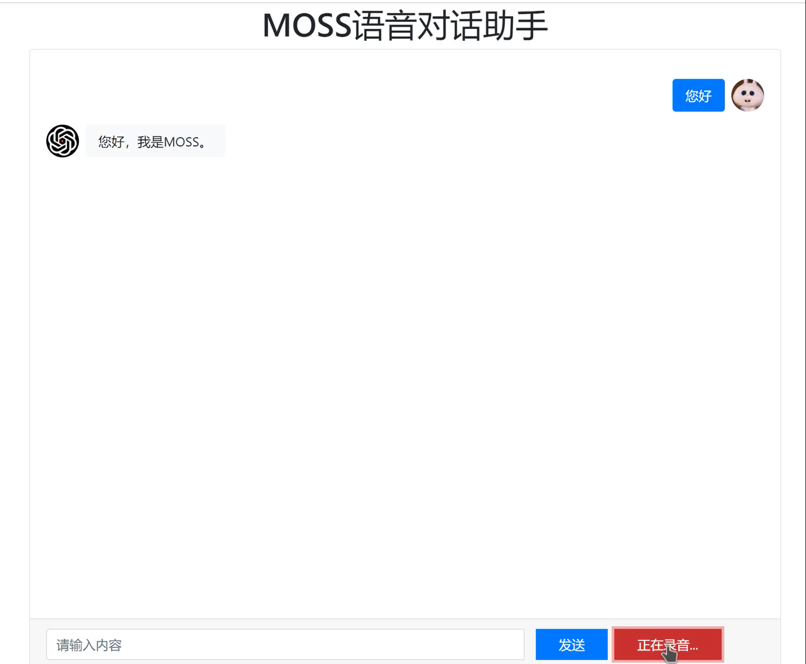

# Local_AI_Speech_Assistant
这是本人对模型本地化的一些摸索

该项目通过ChatGLM、飞浆的语音合成和语音识别，打造了一个可以语音对话的助手应用。这里我用的是MOSS的语音

# 使用
首先，需要先装好ChatGML-6B，参考[ChatGML-6B](https://github.com/THUDM/ChatGLM-6B)
通过api.py文件来启动一个服务接口，这个过程可能会比较漫长
```shell
python3 api.py
```

将release中的inference下载下来放到项目目录下解压，这个是我训练好的MOSS的语音，如果想替换成自己训练的可以参考[【有手就行】使用你自己的声音做语音合成](https://aistudio.baidu.com/aistudio/projectdetail/5003396)
并进行替换

安装依赖
```shell
pip3 install -r requirements.txt
```

**注** 同时需要提前安装好`ffmpeg`的环境

配置config.py文件，检查各个项目的路径，并且可以通过修改HISTORY进行AI角色设定

最终，启动
```shell
python3 app.py
```
访问生成的连接`http://127.0.0.1:9995`

效果如下，并附带音效


# 注意
在使用ChatGML时，一定要注意硬件配置问题

# 感谢
[【有手就行】使用你自己的声音做语音合成](https://aistudio.baidu.com/aistudio/projectdetail/5003396)
[【语音识别】](https://github.com/PaddlePaddle/PaddleSpeech/tree/develop/demos/automatic_video_subtitiles)
[ChatGML-6B](https://github.com/THUDM/ChatGLM-6B)
# 更多
包含更详细的部署系列文章


